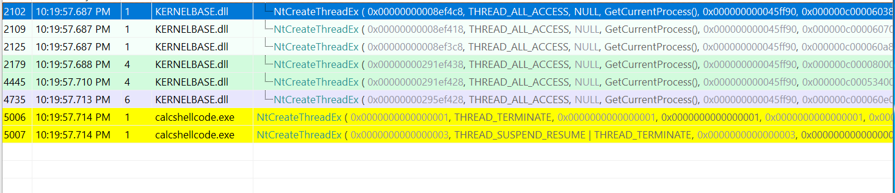

# BananaPhone
Like hells gate, but more go, more banana.

Useful references:
- https://github.com/am0nsec/HellsGate
- https://www.cyberbit.com/blog/endpoint-security/malware-mitigation-when-direct-system-calls-are-used/

This is a pure-go implementation of using direct syscalls to do Windowsy stuff. Don't be silly and try this on not-Windows, it won't work and I honestly don't know why you'd even think it would?

Several useful functions in dealing with process things are provided by this lib. Namely:
- `Syscall` with a provided `sysid` and `uintptr`s to parameters, you're able to do a Windows syscall for pretty much any defined kernel call. I only tried with a handful, but it should work with any/most.
- `GetPEB` return the memory location of the PEB without performing any API calls. At it's core, just does this: `MOVQ 0x60(GS), AX ; MOVQ AX, ret+0(FP)`(this is the Go ASM syntax, incase you're confused.)
- `GetNtdllStart` return the start address of ntdll loaded in process memory. Does not make any API calls (see asm_x64.s for details)
- `WriteMemory` take a byte slice, and write it to a certain memory address (may panic if not writable etc lol)
- A handful of predefined kernel calls like `NtAllocateVirtualMemory` etc. See source for more details and whatnot.

All of the PE parsing and extraction of interesting information is provided by https://github.com/Binject/debug, which adds on to the stdlib `pe` library in some very cool ways.

# Usage

See examples in `example/`.

# Why

Here is an example I posted into a slack chan recently:

```
...
var (
	modntdll = windows.NewLazySystemDLL("ntdll.dll")
	ntapi    = modntdll.NewProc("NtCreateThreadEx")
)
...
	ntapi.Call(0, 1, 1, 1, 1)
	var x *uintptr
	bananaphone.NtCreateThreadEx(createthread, x, 2, 2, 2, 2, 2, 2, 2, 2, 2, 2)
	ntapi.Call(0, 3, 3, 3, 3)
 ```

  
  What you're looking at is the output of API Monitor, which can be used to track a program's API calls. Each function was called with some easy to identify values (all 1's as a parameter, all 2's etc). What this shows is that the call made by `bananaphone.NtCreateThreadEx` is not captured by API Monitor, and any AV/EDR that uses similar methods probably won't catch it either. Neat.
  
